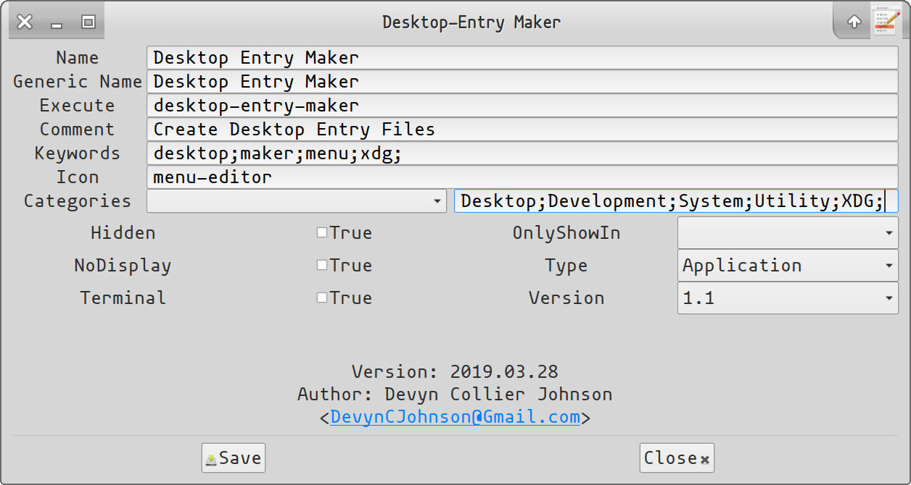

Collection of Software Libraries & Executables
==============================================

- **Owner:** [Devyn Collier Johnson](http://dcjtech.info/members/devyncjohnson/)
- **Email:** <DevynCJohnson@Gmail.com>
- **License:** [LGPLv3](http://www.gnu.org/licenses/lgpl-3.0.txt)
- **GitHub:** <https://github.com/DevynCJohnson/Pybooster>
- **Documentation:** <http://dcjtech.info/Pybooster/>

This project is a rolling-release. The software is stable and suitable for use in other projects.
However, the C-Standard Libraries are still under construction, so do not expect them to work perfectly.

The software libraries can be used with other projects.
EzWin is also included in PyBooster. Ezwin is a collection of GTK windows and interfaces.
This software collection also includes developer tools, icons, and more.

Please consider donating to <http://dcjtech.info/> to help development (click the **Donate** button).

For information on contributing, refer to _[CONTRIBUTING.md](./CONTRIBUTING.md)_ (in this same directory).
Also, refer to _[Coding_Standards.md](./Coding_Standards.md)_ (in this same directory) for further guidelines.

To validate the checksums, execute `make valchecksums` in a terminal in this directory.

Icon Themes
-----------

The icon packages are licensed under GNU General Public License version 3.
Many of the icons originated from GNOME and Tango.

The icons based on or derived from GNOME and other GNOME projects are licensed GPL.
GNOME website: <http://www.gnome.org/>

The icons based on or derived from Tango sources and the Tango project are public domain.
Tango project website: <http://tango.freedesktop.org/Tango_Desktop_Project>

Mimetype Booster
----------------

Many of the mimetypes in _[mimetype_booster.xml](./accessory/mimetype_booster.xml)_ derive from [FreeDesktop.org's](https://FreeDesktop.org) mimetype file.

Included Software
-----------------

Below are screenshots and/or descriptions of some of the included software in this bundle. Read the "Installing/Uninstalling" section to see how to install the desired software.

### Clevo Keyboard Backlight Driver Module for Linux

The module "clevo_kbd_backlight" is a fully working DKMS module that provides support for Clevo keyboard backlights.

### Color Kit

Convert between different color-spaces using Color Kit.

### Desktop Entry Maker

Create XDG desktop entry files (*.desktop) with ease using Desktop Entry Maker.

### Program Analyzer

Disassemble and view information about a library or executable using Program Analyzer.

Requirements
------------

- GNU-GCC >= v8 or Clang >=v6 (if the C source-code will be built)
- Bash Shell
- POSIX-compliant system (Windows may not be fully supported)
- Python3 (version 3.6 or greater)

PyBooster should work on most or all POSIX/UNIX operating systems.
The make-files, shell scripts, and Python scripts will only work on most Unixoid systems.

Other dependencies may be needed. The above listed requirements are the minimal dependencies needed for most of the functionality of this software collection.
Debian-based Linux distros, execute `make getdeps_deb` to install the needed software packages.

Building
--------

To perform the listed build commands, open a terminal and type the given command:

- Compile (nearly) everything: `make all`
- Compile various command-line utilities (such as getpgid, getsid, microtime, ostype, statvfs, typesize, many math utilities, and more): `make programs`
- Compile various command-line utilities (such as acos, asinh, cbrt, cosh, fib, isprime, sin, sinh, sqrt, and more): `make math_programs`
- Compile (nearly) everything: `make all`
- Generate the documentation: `make doc`
- Build code for a Skylake system: `make all ARCH=skylake`
- Build code for a 64-bit system: `make all BITS=64`

Installing/Uninstalling
-----------------------

To install/uninstall software, open a terminal and type the needed command (with Root privileges, if needed). To uninstall any other component, prefix "un" to the install keyword used to install the given component.

- Install Pybooster: `make install`
- Uninstall PyBooster: `make uninstall`
- Additional Mimetypes (XDG Desktops Only): `make install_mimetype_booster`
- Color Kit: `make install_color_kit`
- Command Scripts: `make install_scripts`
- Compiled Programs (after they are built): `make install_programs`
- Desktop Entry Maker: `make install_desktop_entry_maker`
- Enhanced XCompose File: `make install_xcompose`
- Language Specification Files (used by gtksourceview): `make install_langspecs`
- Linux Driver Module for Clevo Keyboard Backlights: `make install_dkms_clevo_kbd_backlight`
- NanoRC Files: `make install_nanorc`
- Opticons Icon Theme (XDG Desktops Only): `make install_Opticons`
- Program-Analyzer: `make install_program_analyzer`
- Python Eggs: `make install_pyeggs`
- Python Libraries: `make install_pylib`
- Shell RC Scripts: `make install_shrc`
- Themes (XDG Desktops Only): `make install_themes`
- Thunar Custom Actions: `make install_uca`

Clean-Up
--------

The below commands perform various project clean-up tasks.

- Remove temporary build files and object files: `make rmtmp`
- Remove Python cache files: `make rmcache`
- Remove all temporary and cache files: `make clean`
- Remove all generated files (but not documentation): `make cleanall`
- Remove all generated files and documentation: `make cleanfull`

Miscellaneous Files
-------------------

There are some miscellaneous files and directories that may be useful to some developers and/or system administrators list below.

- `./accessory/hosts`: An enhanced hosts file that provides many aliases for important IP addresses as well as blocking against various malware and spam servers
- `./accessory/XCompose`: An extended XCompose file
- `./accessory/nanorc/`: Various nanorc files providing additional+better syntax highlighting
- `./jslib/`: Various JavaScript libraries (similar to Python's `./pylib/` libraries in this project)
- `./phplib/`: Various PHP libraries (similar to Python's `./pylib/` libraries in this project)
